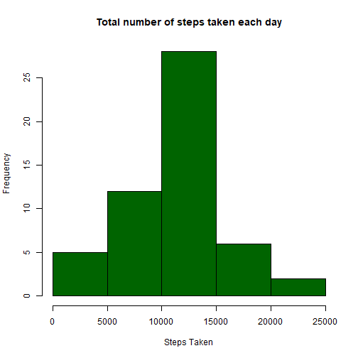
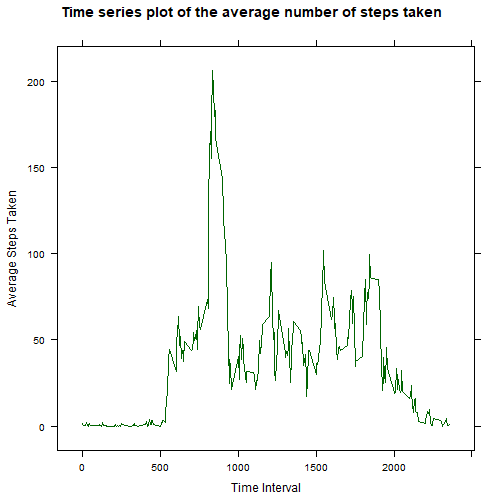
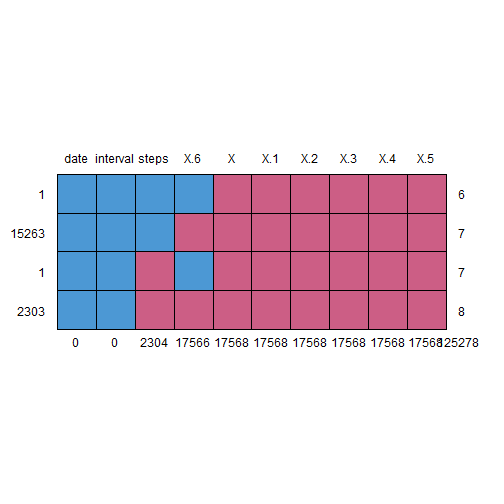
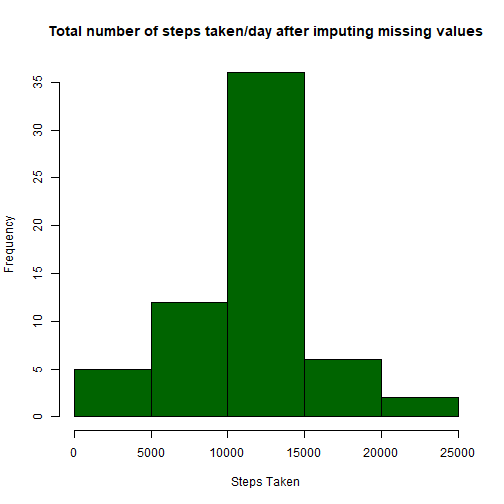
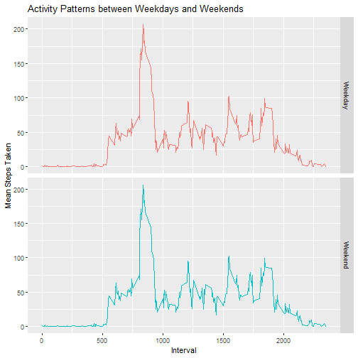

Course Project 1
====================================


**1)** **Code for reading in the dataset and/or processing the data**


```r
setwd("C:/Users/User/Downloads/repres")
d1<-read.csv("activity.csv", header=TRUE, sep=",", stringsAsFactors = FALSE)
```


**2)** **Histogram of the total number of steps taken each day**


```r
a<-as.factor(d1$date)
abis<-strptime(a,format="%Y-%m-%d")
d1$date<-as.Date(abis,format="%Y-%m-%d")
sample<-aggregate(d1$steps, by=list(d1$date), FUN=sum)
hist(sample$x, xlab="Steps Taken", col="dark green", main="Total number of steps taken each day")
```




**3)** **Mean & Median of the Total Number of Steps Taken Each Day** :


```r
m1<-mean(sample$x, na.rm=TRUE)
m2<-median(sample$x, na.rm=TRUE)
cat("Mean Value   : ",m1)
```

```
## Mean Value   :  10766.19
```

```r
cat("Median Value : ",m2)
```

```
## Median Value :  10765
```


**4)** **Time series plot of the average number of steps taken**


```r
a1<-aggregate(d1$steps, by=list(d1$interval), FUN=mean, na.rm=TRUE)
library(ggplot2)
```

```
## Warning: package 'ggplot2' was built under R version 4.0.2
```

```
## Use suppressPackageStartupMessages() to eliminate package startup messages
```

```r
library(lattice)
```

```
## Warning: package 'lattice' was built under R version 4.0.2
```

```r
xyplot(a1$x~a1$Group.1, type="l",col="dark green", xlab="Time Interval", ylab="Average Steps Taken", main="Time series plot of the average number of steps taken")
```




**5)** **The 5-minute interval that, on average, contains the maximum number of steps**

From the time series plot it can be observed that the interval between **800-900** has recorded the maximum number of steps


**6)** **Code to describe and show a strategy for imputing missing data**

**->** **Overall Summary of Activity dataset and the number of missing NA values in the dataset**


```r
library(mice)
```

```
## Warning: package 'mice' was built under R version 4.0.2
```

```
## 
## Attaching package: 'mice'
```

```
## The following objects are masked from 'package:base':
## 
##     cbind, rbind
```

```r
summary(d1)
```

```
##      steps             date               interval         X             X.1            X.2            X.3         
##  Min.   :  0.00   Min.   :2012-10-01   Min.   :   0.0   Mode:logical   Mode:logical   Mode:logical   Mode:logical  
##  1st Qu.:  0.00   1st Qu.:2012-10-16   1st Qu.: 588.8   NA's:17568     NA's:17568     NA's:17568     NA's:17568    
##  Median :  0.00   Median :2012-10-31   Median :1177.5                                                              
##  Mean   : 37.38   Mean   :2012-10-31   Mean   :1177.5                                                              
##  3rd Qu.: 12.00   3rd Qu.:2012-11-15   3rd Qu.:1766.2                                                              
##  Max.   :806.00   Max.   :2012-11-30   Max.   :2355.0                                                              
##  NA's   :2304                                                                                                      
##    X.4            X.5               X.6       
##  Mode:logical   Mode:logical   Min.   :1178   
##  NA's:17568     NA's:17568     1st Qu.:1178   
##                                Median :1178   
##                                Mean   :1178   
##                                3rd Qu.:1178   
##                                Max.   :1178   
##                                NA's   :17566
```

```r
md.pattern(d1)
```



```
##       date interval steps   X.6     X   X.1   X.2   X.3   X.4   X.5       
## 1        1        1     1     1     0     0     0     0     0     0      6
## 15263    1        1     1     0     0     0     0     0     0     0      7
## 1        1        1     0     1     0     0     0     0     0     0      7
## 2303     1        1     0     0     0     0     0     0     0     0      8
##          0        0  2304 17566 17568 17568 17568 17568 17568 17568 125278
```

From the pattern we could conclude that out of **17568** rows there are a total of **2304 NA values** in the **Steps** coloumn of the dataset.

**Strategy for filling in all of the missing values in the dataset**

**->** **The 2034 missing values in the dataset will be replaced with the average number of steps taken**


```r
d1<-cbind(a1$x, d1)
colnames(d1)<-c("Mean Steps", "steps", "date", "interval")
d1$newcol<-ifelse(is.na(d1$steps),d1$`Mean Steps`,d1$steps)
new_df<-data.frame(d1$date,d1$interval,d1$newcol)
colnames(new_df)<-c("date","interval","steps")
```


**7)** **Histogram of the total number of steps taken each day after missing values are imputed**


```r
s1<-aggregate(new_df$steps, by=list(new_df$date), FUN=sum)
hist(s1$x, xlab="Steps Taken", col="Dark Green", main="Total number of steps taken/day after imputing missing values")
```



**->** **Mean & Median of the Total Number of Steps Taken Each Day after imputing missing values** :


```r
n1<-mean(s1$x, na.rm=TRUE)
n2<-median(s1$x, na.rm=TRUE)
cat("Mean Value   : ",n1)
```

```
## Mean Value   :  10766.19
```

```r
cat("Median Value : ",n2)
```

```
## Median Value :  10766.19
```

**->** **There does not seem to be a major difference in the mean and median values after imputing the data.**

**8)** **Panel plot comparing the average number of steps taken per 5-minute interval across weekdays and weekends**


```r
d1$week<-weekdays(d1$date, abbreviate = TRUE)
d1$week1<-ifelse(d1$week %in% c("Mon","Tue","Wed","Thu","Fri"), d1$week1<-"Weekday", d1$week1<-"Weekend")
e1<-aggregate(d1$`Mean Steps`, by=list(d1$interval, d1$week1), FUN=mean, na.rm=TRUE)
g<-ggplot(e1,aes(Group.1,x))+geom_line(aes(colour=Group.2))+ggtitle("Activity Patterns between Weekdays and Weekends")+xlab("Interval")+ylab("Mean Steps Taken")
g+facet_grid(e1$Group.2~.)+theme(legend.position = "none")
```


